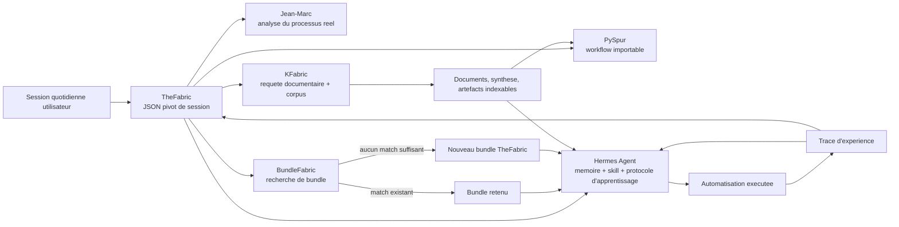

# TheFabric

TheFabric fusionne cinq briques locales :

- Jean-Marc pour l'analyse d'une session de travail et la reconstruction du processus reel
- PySpur pour generer un workflow importable dans un builder visuel
- Hermes Agent pour la memoire, la procedure executable, et la boucle d'apprentissage
- BundleFabric pour retrouver ou creer un bundle specialise
- KFabric pour preparer la recherche documentaire et le corpus qui ancre l'automatisation

L'idee du MVP est simple :

1. on decrit une session quotidienne d'un utilisateur "lambda" en JSON
2. TheFabric produit un JSON pivot d'intelligence de session
3. ce JSON est projete en artefacts Jean-Marc, PySpur et Hermes
4. TheFabric cherche un bundle existant compatible dans BundleFabric
5. si aucun bundle n'est suffisamment pertinent, TheFabric en cree un compatible
6. TheFabric construit ensuite une requete KFabric pour aller chercher les documents qui serviront aux agents
7. Hermes recoit enfin une projection explicite de memoire, skill et protocole d'apprentissage

## Architecture cible



Ce schema resume la logique de fusion du projet :

- TheFabric est l'orchestrateur
- Jean-Marc structure l'observation du travail reel
- PySpur formalise le workflow
- Hermes execute, memorise et apprend
- BundleFabric specialise le runtime
- KFabric apporte le socle documentaire qui fiabilise les decisions

## Pourquoi Hermes est central ici

Dans TheFabric, Hermes n'est pas seulement un runtime secondaire :

- il recupere les faits durables a memoriser
- il recoit une skill procedurale directement derivee de la session observee
- il porte la boucle "observer -> agir -> tracer -> apprendre"
- il s'appuie sur le bundle retenu et sur le corpus KFabric pour rendre l'automatisation robuste

Autrement dit, PySpur formalise le workflow, mais Hermes execute, apprend et capitalise.

## Workflow bout en bout

Voici le deroule fonctionnel vise pour une session quotidienne standard :

1. L'utilisateur decrit ou capture sa session de travail dans un JSON de session.
   Cette entree contient les activites, les outils, les blocages, les decisions et les documents manquants.

2. TheFabric transforme cette session en JSON pivot d'intelligence de travail.
   Ce JSON consolide les etapes observees, les irritants, les artefacts, les regles metier inferees, les recommandations et les cibles d'apprentissage.

3. TheFabric projette ce JSON dans le format Jean-Marc.
   On obtient un `ProcessAnalysis` et une `FieldObservation` qui decrivent l'ecart entre la procedure declaree et le travail reel.

4. TheFabric projette le meme JSON vers PySpur.
   PySpur recoit un workflow template qui peut etre importe dans son builder visuel pour industrialiser le parcours detecte.

5. TheFabric projette aussi ce JSON vers Hermes Agent.
   Hermes recoit :
   - une memoire declarative
   - un profil utilisateur
   - une skill procedurale
   - un protocole d'apprentissage
   - les toolsets recommandes pour l'execution

6. TheFabric recherche ensuite un bundle existant dans BundleFabric.
   Si un bundle couvre deja bien le contexte, il est retenu comme specialisation du runtime.

7. Si aucun bundle n'est assez pertinent, TheFabric cree un nouveau bundle.
   Ce bundle embarque au minimum une identite metier, des capacites, des domaines, des mots-cles et un point d'accroche vers le workflow et le futur corpus.

8. TheFabric prepare une requete KFabric.
   Cette requete sert a recuperer les procedures, policies, modeles, glossaires et autres documents dont les agents auront besoin pour agir correctement.

9. Le corpus KFabric alimente ensuite la boucle d'automatisation.
   Les documents consolides servent a mieux qualifier les cas, mieux repondre, mieux escalader et mieux documenter les exceptions.

10. Hermes execute la procedure automatisee et apprend de l'experience.
    A chaque run, Hermes peut capitaliser les decisions repetitives, enrichir la memoire utile et faire evoluer la skill si le processus se stabilise ou change.

En resume :

- Jean-Marc explique ce qui se passe vraiment
- PySpur dessine le workflow
- Hermes porte l'intelligence operationnelle et l'apprentissage
- BundleFabric specialise l'agent
- KFabric donne la connaissance documentaire necessaire

## Structure generee

Une execution cree typiquement :

- `session_intelligence.json` : le JSON pivot TheFabric
- `jean_marc/` : `process_analysis.json` et `field_observation.json`
- `pyspur/workflow_template.json` : workflow importable/adaptable dans PySpur
- `hermes/` : `ingestion.json`, `MEMORY.md`, `USER.md`, et une skill Hermes
- `bundles/` : resolution de bundles et bundle cree si necessaire
- `kfabric/` : `query_create.json` et plan d'appels API
- `run_summary.md` : lecture humaine du resultat

## Usage

Depuis la racine du repo :

```bash
python3 -m thefabric run \
  --input examples/daily_session.json \
  --output artifacts/demo
```

Optionnellement, si KFabric tourne en local :

```bash
python3 -m thefabric run \
  --input examples/daily_session.json \
  --output artifacts/demo \
  --kfabric-url http://127.0.0.1:8000 \
  --kfabric-api-key change-me
```

## Format d'entree

Le fichier d'entree decrit une session quotidienne :

- metadonnees de session
- objectif principal
- procedure declaree connue ou non
- liste d'activites horodatees
- artefacts d'entree/sortie
- decisions, blocages, documents necessaires

Un exemple complet est fourni dans `examples/daily_session.json`.
